```mermaid
flowchart LR
  P0[Phase 0 Sketch] --> P1[Phase 1 Single-hop]
  P1 --> P2[Phase 2 Two-hop]
  P2 --> P3[Phase 3 Path rotation]
  P3 --> P4[Phase 4 Invites]
  P4 --> P5[Phase 5 Profiles]
  P5 --> P6[Phase 6 PQ hybrid]
  P6 --> P7[Phase 7 Metadata]
  P7 --> P8[Phase 8 Mobile]
  P8 --> P9[Phase 9 Public spec]
```

# Yakr Phased Reference Design

**Version:** Draft v0.1  
**Status:** Implementation guide  
**Companion:** [whitepaper.md](../whitepaper.md)

This document turns the Yakr whitepaper into a buildable reference implementation plan. Each phase adds the smallest set of protocol, crypto, and product surfaces needed to prove the next claim. Later phases must not block earlier ones.

---

## 1. Purpose

The reference design answers four questions for every phase:

1. **What must work before we move on?** — exit criteria, not aspirations.
2. **What do we build?** — Python packages, CLI entry points, APIs, wire formats.
3. **What do we deliberately defer?** — scope control.
4. **What decisions are frozen vs. provisional?** — version boundaries.

Phases are sequential for the reference implementation. The protocol may later support capability negotiation so newer clients interoperate with older relays where possible.

---

## 2. Design Principles (Implementation)

These constrain all phases:

| Principle | Implementation rule |
|-----------|---------------------|
| Python reference | Reference code in Python 3.12+; wire formats are language-agnostic |
| Protocol-first | `yakr-spec` and test vectors lead code changes, not the reverse |
| Classical before PQ | Phases 1–5 use classical crypto only; PQ is additive in Phase 6 |
| One transport first | HTTP/JSON relay API in early phases; no DHT/Tor/WebRTC until Phase 8+ |
| Relays are dumb | Relays verify structure, auth, limits, and expiry — not chat semantics |
| Local-first state | Contacts, sessions, and history live on the client |
| Fail visibly | Undelivered messages stay pending with explicit reason codes |
| No global IDs | Contacts exist only as pairwise relationships established by invite |

---

## 3. Repository Layout

Python monorepo (uv workspace) for the reference implementation:

```text
yakr/
├── docs/
│   ├── REFERENCE_DESIGN.md      # this file
│   ├── spec/                    # normative protocol docs per phase
│   └── diagrams/
├── packages/
│   ├── yakr-core/               # crypto, sessions, blobs, routing logic
│   ├── yakr-relay/              # relay daemon (FastAPI + uvicorn)
│   ├── yakr-cli/                # developer / demo client (Typer)
│   └── yakr-testkit/            # simulators, fixtures, interop harness
├── scripts/
│   └── demo_offline_delivery.sh
├── pyproject.toml               # workspace root
├── whitepaper.md
└── README.md
```

Each package layout:

```text
packages/yakr-core/
├── pyproject.toml
├── src/yakr_core/
│   ├── __init__.py
│   ├── contact.py
│   ├── session.py
│   └── ...
└── tests/
```

Future (not in early phases):

```text
├── apps/
│   └── yakr-mobile/             # BeeWare or Chaquopy Android shell
└── tools/
    └── yakr-qr/                 # invite encoding utilities
```

### Package Responsibilities

**`yakr-core`** — pure library, no network I/O:

- Identity and device key management
- Pairwise contact establishment
- Session ratchet (classical, then hybrid PQ)
- Blob construction and parsing
- Mailbox tag derivation
- Route selection
- Local encrypted store interface

**`yakr-relay`** — network-facing relay:

- HTTP API (Phase 1+)
- Blob storage backend (filesystem → SQLite → optional object store)
- Rate limits, quotas, expiry sweeper
- Minimal logging policy

**`yakr-cli`** — reference client:

- Subcommands per simulated user (`alice`, `bob`, `charlie`, …)
- Invite generation and acceptance
- Send, fetch, relay mode
- Scripted demo scenarios

**`yakr-testkit`** — shared by all phases:

- Multi-process local orchestration
- Deterministic clocks for epoch/tag tests
- Golden packet fixtures

---

## 4. Protocol Versioning

Protocol version string: `yakr-v0.<phase>` during development.

| Phase | Protocol tag | Wire encoding | Crypto suite |
|-------|--------------|---------------|--------------|
| 1 | `yakr-v0.1` | JSON (dev only) | Classical v1 |
| 2 | `yakr-v0.2` | CBOR packets | Classical v1 |
| 3 | `yakr-v0.3` | CBOR packets | Classical v1 |
| 4 | `yakr-v0.4` | CBOR packets | Classical v1 |
| 5 | `yakr-v0.5` | CBOR packets | Classical v1 |
| 6 | `yakr-v0.6` | CBOR packets | Hybrid PQ v1 |
| 7+ | `yakr-v1.0` | CBOR packets | Hybrid PQ v1 (frozen) |

JSON is allowed in Phase 1 for velocity. Phase 2 switches to canonical CBOR for all on-wire relay and blob envelopes. Phase 1 JSON schemas are preserved as test fixtures.

---

## 5. Phase Overview

```text
Phase 0  Protocol sketch                    [complete]
Phase 1  Single-hop offline delivery        prove store-and-forward works
Phase 2  Two-hop onion + receipts           split entry/mailbox metadata
Phase 3  Path rotation                      per-message route diversity
Phase 4  Invites + relay authorization      real contact bootstrap
Phase 5  Delivery profiles                  reachable-offline routing data
Phase 6  Hybrid post-quantum KEX            harvest-now-decrypt-later defense
Phase 7  Metadata hardening                 padding, batching, privacy modes
Phase 8  Mobile reference client            Android-first product surface
Phase 9  Public protocol + interop          spec freeze, third-party clients
```



---

## Phase 0 — Protocol Sketch

**Status:** Complete  
**Deliverables:** `whitepaper.md`, this document

### Goal

Align on problem framing, terminology, threat model, and phased scope before writing production code.

### Exit Criteria

- [x] Whitepaper describes actors, threat model, and non-goals
- [x] Reference design defines packages, phases, and version strategy
- [x] Glossary frozen in `docs/spec/glossary.md` (Phase 1 prerequisite)

---

## Phase 1 — Single-Hop Offline Delivery

**Depends on:** Phase 0  
**Protocol:** `yakr-v0.1`  
**Status:** Complete  
**Target user:** Developer running a local four-user demo

### Goal

Prove the core Yakr claim: **Alice can deliver an encrypted message to offline Bob through a friend relay without a central message server.**

### User-Visible Capability

```text
alice send bob "hello"
# bob is offline

charlie relay start   # Charlie runs a mailbox relay for Bob

bob fetch
# bob sees: hello
```

### Architecture

```text
┌─────────┐   encrypt    ┌──────────────┐   store by tag   ┌─────────────┐
│  Alice  │ ───────────► │ Charlie relay │ ───────────────► │ blob store  │
└─────────┘   HTTP POST  └──────────────┘                  └──────┬──────┘
                                                                   │
┌─────────┐   decrypt    ┌──────────────┐   fetch by tag          │
│   Bob   │ ◄─────────── │  Bob client  │ ◄─────────────────────┘
└─────────┘              └──────────────┘
```

One relay acts as **mailbox relay** only. No onion wrapping. No path rotation. No receipts.

### In Scope

| Area | Decision |
|------|----------|
| Identity | One identity keypair per CLI user (Ed25519) |
| Contact | Pre-shared contact config file (invite flow deferred to Phase 4) |
| Session | X25519 static-ephemeral KEX → HKDF master secret |
| Messages | XChaCha20-Poly1305 AEAD inner payload |
| Mailbox tags | HMAC-SHA256 over `(direction, epoch)` with hourly epochs |
| Relay API | `POST /v1/blobs`, `GET /v1/blobs/{tag}` |
| Storage | Relay stores opaque blobs on disk with TTL (7 days default) |
| Client store | SQLite: contacts, sessions, outbound pending, inbound messages |
| Transport | localhost HTTP; **Docker Compose for multi-client testing** |

### Out of Scope

- Two-hop routing, onion layers
- Path rotation, dummy traffic, padding
- Delivery receipts
- Post-quantum crypto
- QR invites, delivery profiles
- Direct P2P
- Mobile

### Wire Surfaces (Phase 1)

**Inner message** (encrypted, recipient-only):

```text
inner_message {
  version: u8
  conversation_id: bytes32
  sender_device_id: bytes16
  seq: u64
  created_at: unix_ms
  type: enum { text }
  body: bytes
}
```

**Outer blob** (relay-visible):

```text
outer_blob {
  version: u8
  mailbox_tag: bytes32
  expires_at: unix_ms
  ciphertext: bytes
}
```

**Relay store request:**

```text
POST /v1/blobs
{
  "mailbox_tag": "<base64>",
  "expires_at": 1719835200000,
  "ciphertext": "<base64>"
}
```

Relay validates: tag length, expiry in future, size ≤ 64 KiB, rate limit.

### Crypto Profile — Classical v1

```text
Identity signing:     Ed25519
Initial KEX:          X25519
KDF:                  HKDF-SHA256
Message AEAD:         XChaCha20-Poly1305
Mailbox tag:          HMAC-SHA256
```

Domain separation strings (frozen):

```text
yakr/v0.1/master
yakr/v0.1/message-key
yakr/v0.1/mailbox-tag
```

### Components to Build

| Component | Deliverable |
|-----------|-------------|
| `yakr-core` | `Contact`, `Session`, `BlobBuilder`, `MailboxTag`, `LocalStore` protocol |
| `yakr-relay` | `yakr-relay serve` entry point, filesystem blob backend, TTL sweeper |
| `yakr-cli` | `yakr` CLI: `init`, `send`, `fetch`, `relay` subcommands |
| `yakr-testkit` | `scripts/demo_offline_delivery.sh`, pytest fixtures, Docker Compose harness |
| `docker-compose.yml` | `relay` + per-identity client services (`alice`, `bob`, …) with isolated volumes |
| `docs/spec` | `phase-1-single-hop.md`, JSON schemas |

### Exit Criteria

- [x] Four CLI identities run in one test script without manual steps
- [x] Alice sends while Bob is offline; Bob fetches after Alice exits
- [x] Relay never receives plaintext or stable sender/recipient IDs
- [x] Expired blobs are rejected on store and deleted by sweeper
- [x] Duplicate `seq` from same sender is detected client-side
- [x] README documents the demo in under 5 commands

### Risks

| Risk | Mitigation |
|------|------------|
| Over-building crypto ratchet in Phase 1 | Use simplified session with manual rekey deferred to Phase 4 |
| Relay spam | localhost + fixed API key in Phase 1; real auth in Phase 4 |

---

## Phase 2 — Two-Hop Onion Relay

**Depends on:** Phase 1  
**Protocol:** `yakr-v0.2`  
**Status:** Complete

### Goal

Split relay visibility so **no single honest relay observes both sender upload and recipient fetch** for the same message.

### User-Visible Capability

```text
# Dennis = entry relay, Charlie = mailbox relay
alice send bob "hello" --route dennis,charlie
bob fetch
```

### Architecture

```text
Alice
  │  onion packet
  ▼
Dennis (entry)  ──forward──►  Charlie (mailbox)  ──store──►  tag bucket
                                                                  │
Bob ◄──────────────────────── fetch by tag ──────────────────────┘
```

### In Scope

| Area | Decision |
|------|----------|
| Relay roles | `entry`, `mailbox` (a node may hold both roles) |
| Onion wrap | Two layers: entry forward instruction, mailbox store instruction |
| Packet encoding | CBOR `relay_packet` replaces JSON blob POST body |
| Expiry | Enforced at mailbox; entry forwards even if near expiry |
| Receipts | Minimal delivery receipt: `delivered` type only |
| Relay forwarding | `POST /v1/forward` on entry relay |
| Receipt path | Reverse two-hop back to sender |

### Onion Packet Structure

```text
relay_packet {
  version: u8
  outer: aead_entry {
    next_relay_id: bytes32
    inner_ciphertext: bytes
  }
  // decrypted by entry relay →
  mailbox_instruction {
    mailbox_tag: bytes32
    expires_at: unix_ms
    blob_ciphertext: bytes   // Bob-decryptable inner blob
  }
}
```

Each layer uses a relay-specific key derived from a **relay capability ticket** issued when a contact authorizes a relay (static config in Phase 2; dynamic in Phase 4).

### Receipt Flow

```text
receipt_inner {
  message_id: bytes32
  type: delivered
  recipient_device_id: bytes16
  timestamp: unix_ms
}
```

Sender keeps outbound queue until receipt or expiry.

### Out of Scope

- Per-message path rotation (Phase 3)
- Padding size classes
- PQ crypto
- Formal invites

### Exit Criteria

- [x] Entry relay logs show next-hop only, not mailbox tag or plaintext
- [x] Mailbox relay logs show store/fetch, not original sender
- [x] Alice receives delivery receipt after Bob fetches
- [x] Collusion test documents what Dennis+Charlie can infer (timing, size)
- [x] CBOR packets round-trip via golden fixtures in `yakr-testkit`

---

## Phase 3 — Path Rotation

**Depends on:** Phase 2  
**Protocol:** `yakr-v0.3`  
**Status:** Complete

### Goal

Ensure **successive messages between the same contacts do not reuse the same entry/mailbox pair** by default.

### In Scope

| Area | Decision |
|------|----------|
| Relay registry | Per-contact list of authorized relays with weights |
| Route selection | `route_seed = HKDF(conv_secret, message_id \|\| "route")` |
| Scoring | Availability, trust tier, recent success, path reuse penalty |
| Constraints | No same entry twice in a row; no same mailbox twice in a row |
| Retry | Different route on failure; max 3 attempts |
| Observability | Client-side route audit log for debugging |

### Route Selection Algorithm (Reference)

```text
1. candidates = authorized relays for contact
2. seed = HKDF(conv_secret, message_id || "route")
3. score each (entry, mailbox) pair:
     base = trust_weight * health_weight
     penalty = recent_use_penalty(entry) + recent_use_penalty(mailbox)
4. weighted_sample(seed, scores)
5. reject if violates reuse limits; resample up to N times
```

### Out of Scope

- Multi-path attachment chunking
- Erasure coding
- Geographic diversity (no geo IP in reference impl)

### Exit Criteria

- [x] 100 sequential messages across 4 relays show no immediate entry/mailbox repeat
- [ ] Simulated relay failure triggers alternate route and eventual delivery
- [x] Route choices reproducible given `(conv_secret, message_id)` for tests

---

## Phase 4 — Invites and Relay Authorization

**Depends on:** Phase 3  
**Protocol:** `yakr-v0.4`  
**Status:** Complete

### Goal

Replace pre-shared config files with **invite-based contact establishment** and cryptographically enforced relay permissions.

### In Scope

| Area | Decision |
|------|----------|
| Invite bundle | Signed binary CBOR: identity key, one-time secret, rendezvous hint, expiry |
| Invite encoding | `yakr://invite/<base64url>` and QR-compatible payload |
| Safety code | Short fingerprint of long-term identity keys |
| Rendezvous | Local HTTP rendezvous server in CLI; LAN discovery optional |
| Relay auth | Signed **store ticket** and **forward ticket** bound to relay public key |
| Ratchet | Classical double-ratchet (`python-axolotl` pattern or minimal in-tree impl) |
| Session binding | Transcript hash included in initial KEX |

### Invite Bundle (Binary)

```text
invite_bundle {
  protocol: "yakr-v0.4"
  identity_pubkey: bytes
  invite_secret: bytes32
  rendezvous_hint: bytes
  expires_at: unix_ms
  capabilities: [enum]
  signature: bytes
}
```

### Relay Authorization Ticket

```text
relay_ticket {
  relay_pubkey: bytes
  contact_id: bytes32
  permissions: { store, forward }
  expires_at: unix_ms
  issuer_device_signature: bytes
}
```

Relay verifies ticket signature against a known contact issuer key before accepting blobs.

### Out of Scope

- Public DHT rendezvous
- Post-quantum signatures on invites
- Multi-device linking UI

### Exit Criteria

- [x] Alice generates QR invite; Bob scans/imports and completes pairing with no pre-shared files
- [x] Safety codes match on both devices
- [x] Relay rejects blob without valid ticket
- [x] Consumed invite cannot be replayed
- [x] Session survives CLI restart (persisted ratchet state)

---

## Phase 5 — Delivery Profiles

**Depends on:** Phase 4  
**Protocol:** `yakr-v0.5`

### Goal

Allow each contact to communicate **how to reach them when direct delivery fails**, using signed, expiring, opaque relay descriptors.

### In Scope

| Area | Decision |
|------|----------|
| Profile object | Signed CBOR exchanged at pairing and on refresh |
| Contents | Relay descriptors, mailbox epoch params, blob size limits, receipt policy |
| Refresh | Automatic on direct contact; fallback to stale profile with warning |
| Expiry | Profiles valid 7 days default |
| Direct P2P attempt | CLI tries localhost/direct hint first, 2s timeout, then relay |
| Multi-mailbox | Bob may publish 2+ mailbox relays in profile |

### Delivery Profile

```text
delivery_profile {
  version: u32
  valid_from: unix_ms
  valid_until: unix_ms
  direct_hints: [string]
  relay_descriptors: [relay_descriptor]
  mailbox_params: { epoch_secs, direction_salt }
  blob_classes: [u32]
  receipt_policy: enum { minimal, none }
  signature: bytes
}
```

### Out of Scope

- Tor/onion direct hints
- Profile hosting on third-party servers
- Automatic public relay discovery

### Exit Criteria

- [ ] Bob updates profile; Alice uses new mailbox relay without manual config edit
- [ ] Stale profile attempt logs warning and retries after refresh
- [ ] Direct P2P success bypasses relay when both CLIs online on LAN

---

## Phase 6 — Hybrid Post-Quantum Key Agreement

**Depends on:** Phase 5  
**Protocol:** `yakr-v0.6`  
**Crypto suite:** Hybrid PQ v1

### Goal

Add **harvest-now-decrypt-later resistance** without breaking classical-only clients that negotiate down.

### In Scope

| Area | Decision |
|------|----------|
| KEX | X25519 + ML-KEM-768 → HKDF combiner |
| Capability flag | `hybrid_pq` in invite and profile capabilities |
| PQ on invites | ML-DSA signature optional alongside Ed25519 (dual-sign) |
| Rekey | PQ rekey every 7 days or 10,000 messages, whichever first |
| Library | `liboqs-python` or equivalent — evaluated in ADR |
| Test vectors | Published KAT-style fixtures for hybrid KEX |

### Hybrid KEX Transcript

```text
x_secret  = X25519(alice_ephemeral, bob_static)
pq_secret = ML-KEM.Decaps(bob_kem_ct, alice_kem_sk)
master    = HKDF-SHA256(
              ikm  = x_secret || pq_secret,
              salt = transcript_hash,
              info = "yakr/v0.6/hybrid-master"
            )
```

### Out of Scope

- PQ signatures on every chat message
- PQ per-message encapsulation
- Custom combiner algorithms

### Exit Criteria

- [ ] Hybrid-capable clients establish session with PQ component
- [ ] Classical-only peer negotiates fallback when `hybrid_pq` absent
- [ ] Test vectors pass in CI across two independent implementations (core + testkit verifier)
- [ ] ADR documents PQ library choice and audit status

---

## Phase 7 — Metadata Hardening

**Depends on:** Phase 6  
**Protocol:** `yakr-v0.7`

### Goal

Add **practical metadata reduction** with explicit privacy modes, without making the default mode unusable.

### Privacy Modes

| Mode | Padding | Fetch strategy | Dummy traffic | Relay delay |
|------|---------|----------------|---------------|-------------|
| Fast | none | on-demand | off | 0s |
| Balanced | 4 KiB classes | scheduled + 3 decoy tags | off | 0–15s |
| High | 4/32 KiB classes | fixed schedule + bucket fetch | optional | 5–90s |

### In Scope

| Area | Decision |
|------|----------|
| Padding | Pad inner plaintext to size class before AEAD |
| Batch fetch | Client requests tag set per epoch window |
| Decoy tags | Derive N−1 decoy tags per real fetch in High mode |
| Relay delay | Optional random forward delay (mailbox role) |
| Dummy blobs | High mode only; rate-limited |
| Metrics | Client-side privacy/bytes tradeoff stats |

### Out of Scope

- Full mixnet
- Constant-rate global traffic shaping

### Exit Criteria

- [ ] Balanced mode: relay observer cannot distinguish 300 B vs 2 KiB message at ciphertext level
- [ ] High mode: scripted traffic analysis test shows reduced upload/fetch correlation
- [ ] Fast mode latency within 2× of Phase 5 baseline in local benchmark
- [ ] Battery/bandwidth cost documented per mode

---

## Phase 8 — Mobile Reference Client (Android First)

**Depends on:** Phase 7  
**Protocol:** `yakr-v1.0` (candidate freeze)

### Goal

Prove Yakr works on a **real mobile device** with offline delivery, invite QR, and optional relay participation.

### In Scope

| Area | Decision |
|------|----------|
| Platform | Android first (Briefcase app embedding `yakr-core`, or Kotlin + Chaquopy) |
| Storage | SQLCipher via `sqlcipher3` or encrypted SQLite wrapper |
| UI | 1:1 chat, contact list, invite QR, safety code screen |
| Notifications | Polling worker default; optional unified push stub |
| Relay mode | Foreground service; Wi-Fi + charging toggle |
| Networking | HTTPS relay, battery-aware fetch interval |
| Packaging | Sideload APK; Play Store deferred |

### Android Architecture

Option A — **BeeWare Briefcase** (preferred for a pure-Python reference):

```text
┌──────────────────────────────────────┐
│     Yakr Android App (Briefcase)      │
│  Toga UI │ background fetch worker   │
│  optional relay service (opt-in)     │
└──────────────────┬───────────────────┘
                   │ import
┌──────────────────▼───────────────────┐
│         yakr-core (Python)            │
└──────────────────────────────────────┘
```

Option B — **Chaquopy** if native Compose UI is required later:

```text
Kotlin Compose UI  →  Chaquopy  →  yakr-core (Python)
```

Phase 8 starts with Option A to keep one language through the stack.

### Out of Scope (Phase 8)

- iOS app
- Attachments > 1 MiB
- Groups
- App Store submission

### Exit Criteria

- [ ] Two Android devices exchange messages with one offline, relay on third device or VPS
- [ ] QR invite works device-to-device
- [ ] Relay mode respects Wi-Fi/charging constraints
- [ ] App survives process death; messages persist and resume fetch

---

## Phase 9 — Public Protocol and Interop

**Depends on:** Phase 8

### Goal

Freeze **Yakr Protocol v1.0** as an implementable open standard with independent client interop.

### Deliverables

```text
docs/spec/yakr-protocol-v1.md     normative spec
docs/spec/test-vectors-v1/        KEX, packets, invites, profiles
docs/security/analysis-v1.md      threat model + mitigations
interop/                          third-party client checklist
```

### Exit Criteria

- [ ] Second client (minimal CLI or mobile) passes interop suite using only public spec
- [ ] Security analysis reviewed against stated threat model
- [ ] Versioning and extension rules documented
- [ ] Relay reference implementation passes abuse-limit conformance tests

---

## 6. Cross-Cutting Concerns

### Error Model

All components use structured errors:

```text
YAKR_ERR_RELAY_OFFLINE
YAKR_ERR_RELAY_UNAUTHORIZED
YAKR_ERR_BLOB_EXPIRED
YAKR_ERR_DECRYPT_FAILED
YAKR_ERR_PROFILE_STALE
YAKR_ERR_ROUTE_EXHAUSTED
YAKR_ERR_INVITE_EXPIRED
```

Clients surface user-readable messages; logs retain error codes.

### Logging Policy (Relays)

Relays may log:

```text
timestamp, relay_id, event_type, blob_size_class, outcome
```

Relays must not log:

```text
mailbox_tag, sender id, recipient id, IP + tag correlation, plaintext
```

### Testing Strategy

| Layer | Approach |
|-------|----------|
| `yakr-core` | unit tests + golden vectors |
| `yakr-relay` | integration tests with temp data dir |
| `yakr-cli` | end-to-end shell scripts + pytest per phase |
| Privacy | scripted adversary simulators from Phase 2 onward |

### Technology Choices (Reference Impl)

| Concern | Choice | Rationale |
|---------|--------|-----------|
| Language | Python 3.12+ | fast iteration, readable reference code |
| Packaging | uv workspace | modern lockfile, monorepo-friendly |
| CLI | Typer | typed commands, good UX for demos |
| Relay HTTP | FastAPI + uvicorn | async-ready, easy local dev |
| AEAD / KEX / Ed25519 | PyNaCl + `cryptography` | audited bindings to libsodium/OpenSSL |
| CBOR | `cbor2` | canonical wire encoding from Phase 2 |
| Testing | pytest + pytest-asyncio | standard Python test tooling |
| PQ (Phase 6+) | `liboqs-python` or ADR pick | Python PQ bindings still maturing |
| Client storage | `sqlite3` (stdlib) | simple, portable |
| Relay storage | SQLite + blob files on disk | simple ops |
| Mobile (Phase 8) | BeeWare Briefcase | reuse `yakr-core` without FFI rewrite |

**Note:** The Python reference implementation optimises for clarity and protocol validation, not production mobile performance. A future production client may reimplement `yakr-core` in Rust or Go while keeping the same wire formats.

---

## 7. Open Decisions Register

Track unresolved items here; close with ADRs in `docs/adr/`.

| ID | Question | Target phase | Default if unresolved |
|----|----------|--------------|----------------------|
| OD-01 | Double ratchet library vs. custom | 4 | Minimal in-tree ratchet; no heavy Signal port |
| OD-02 | PQ library selection | 6 | `liboqs-python` if viable, else subprocess to `oqs` CLI for vectors only |
| OD-03 | Push strategy on mobile | 8 | Polling only |
| OD-04 | Public DHT for invite rendezvous | 9+ | Defer; LAN + manual relay |
| OD-05 | Attachment chunking design | 9+ | Out of v1 scope |
| OD-06 | Multi-device model | 9+ | Primary device signs secondary enrollment |
| OD-07 | Public relay incentives | 9+ | Community relay docs only |

---

## 8. Success Metrics

| Milestone | Metric |
|-----------|--------|
| Phase 1 | Offline delivery demo runs in CI in < 30s |
| Phase 2 | Single-relay adversary cannot link sender+recipient in test harness |
| Phase 3 | ≥ 4 relays, 100 messages, zero consecutive path repeats |
| Phase 4 | Cold-start pairing < 60s human time (QR) |
| Phase 5 | Profile refresh without manual config |
| Phase 6 | Hybrid KEX test vectors pass |
| Phase 7 | Balanced mode hides size class in ciphertext |
| Phase 8 | Two Android phones deliver offline via relay |
| Phase 9 | Independent client passes interop suite |

---

## 9. Immediate Next Steps

To begin Phase 1 implementation:

1. Add `docs/spec/glossary.md` and `docs/spec/phase-1-single-hop.md`
2. Scaffold uv workspace: `packages/yakr-core`, `yakr-relay`, `yakr-cli`, `yakr-testkit`
3. Implement classical crypto session + mailbox tags in `yakr_core`
4. Implement minimal FastAPI relay with blob store
5. Ship `scripts/demo_offline_delivery.sh` and `docker-compose.yml` as the Phase 1 exit gate

---

## 10. Relationship to Whitepaper

| Whitepaper section | Reference design phase |
|--------------------|------------------------|
| §8 Invitations | Phase 4 |
| §9 Delivery profiles | Phase 5 |
| §11 Mailbox tags | Phase 1 (basic), Phase 7 (hardening) |
| §13 Two-hop delivery | Phase 2 |
| §14 Path rotation | Phase 3 |
| §15 Padding / cover traffic | Phase 7 |
| §16 Post-quantum crypto | Phase 6 |
| §25 Roadmap | Phases 0–9 (this doc refines ordering) |

The whitepaper describes the full vision. This document defines what to build, in what order, and when the reference implementation is allowed to claim success.
