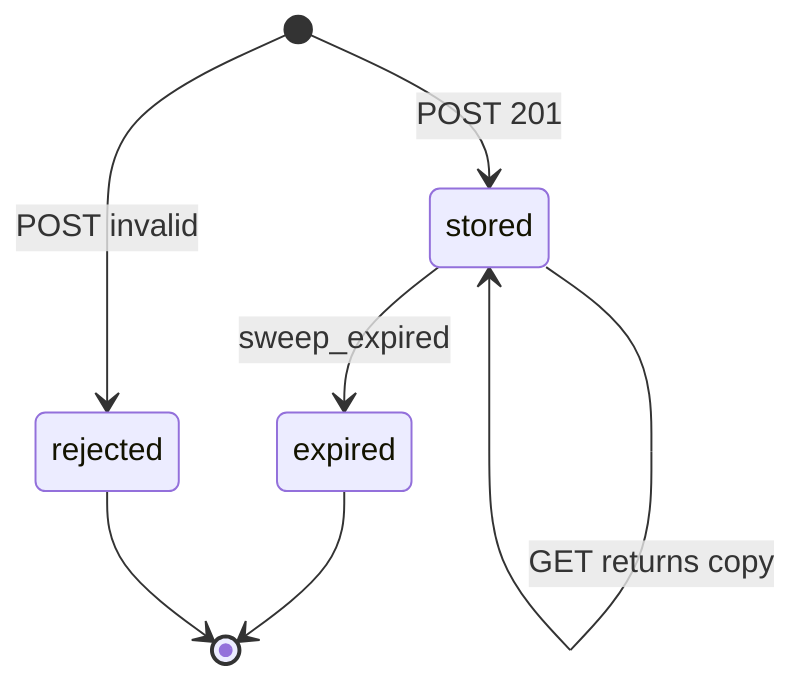
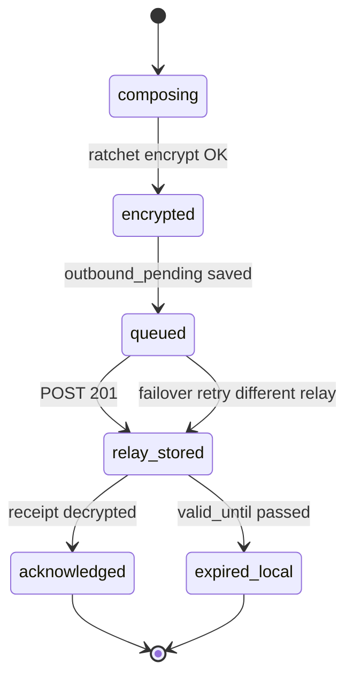
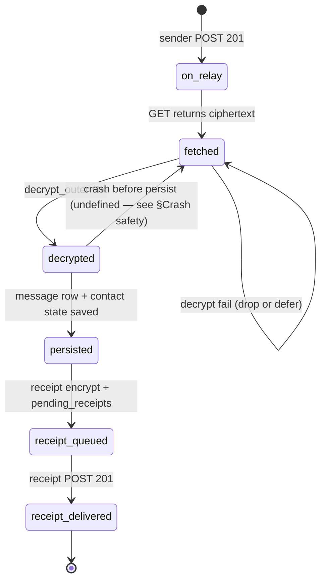

# Delivery State Machine — Message, Receipt, and Relay Blob

**Protocol:** `yakr-v1.0` (normative draft; P0 hardening)  
**Status:** Draft — derived from [external review](../reviews/external-critique-2026-07-10.md) P0  
**Related:** [fetch-algorithm.md](./fetch-algorithm.md), [ephemeral-messages.md](./ephemeral-messages.md)

## Purpose

Messaging protocols fail at edge cases, not the happy path. This document gives **exact** delivery semantics for implementers: states, transitions, idempotency, crash behaviour, and relay retention.

## Design principles (normative)

1. **At-least-once transport** — relays MAY return the same blob on every poll until expiry.
2. **Idempotent recipient processing** — duplicate ciphertext or `seq` MUST NOT advance state twice.
3. **Authenticated acknowledgement** — senders clear `outbound_pending` only on verified E2E `receipt` inner messages, not on relay fetch alone.
4. **Relay confidentiality** — relays MUST NOT decrypt application plaintext; they learn mailbox tags, sizes, and timing (see [security analysis §8.5](../security/analysis-v1.md)).

## TTL layers (normative v1)

| Layer | Field | v1 policy |
|-------|-------|-----------|
| Protocol maximum | `expires_at` on relay blob | ≤ 24h from `now` at `POST` ([ephemeral-messages.md](./ephemeral-messages.md)) |
| Inner message | `valid_until` | `created_at + 24h` |
| Sender local pending | `outbound_pending` | Until receipt or inner `valid_until` |
| Relay actual retention | sweep job | Delete blob when `expires_at ≤ now` |

Future attachment classes MAY define shorter sender-requested TTLs; relay MUST reject `expires_at` above protocol maximum.

**v1 decision:** relay blobs are **not** deleted on fetch or on receipt. Deletion is **TTL sweep only**. This tolerates recipient crash/re-fetch and duplicate polls at the cost of relay storage until expiry.

## Relay blob lifecycle



| State | Meaning | Visible to |
|-------|---------|------------|
| `rejected` | Validation failed (tag, size, expiry, ticket, cap) | Sender |
| `stored` | Opaque ciphertext indexed under `mailbox_tag` | Relay, fetcher with tag |
| `expired` | Removed by relay sweeper | Nobody |

### Relay answers (normative)

| Question | v1 answer |
|----------|-----------|
| Does fetch delete the blob? | **No** |
| Can the relay return the same blob repeatedly? | **Yes**, until `expired` |
| Can a fetcher delete someone else's blob? | **No** — no delete API in v1 |
| Is acknowledgement separate from retrieval? | **Yes** — receipt is E2E inner message |

## Outbound message (sender client)

States are per `(contact, msg_id)` where `msg_id = hash(ciphertext)`.



| State | Persistent fields | Transition |
|-------|-------------------|------------|
| `composing` | — | User initiates send |
| `encrypted` | ratchet advanced in memory | `Session.encrypt` success |
| `queued` | `outbound_pending`, ratchet on disk | Atomic persist **required** (see §Crash safety) |
| `relay_stored` | same + known relay URL | Any relay POST 201 |
| `acknowledged` | pending row deleted | Inbound `receipt` for `msg_id` |
| `expired_local` | pending row deleted | `valid_until` passed; user may resend as new `seq` |

**Retry:** On POST failure, sender MAY try another authorized relay (failover). Same ciphertext and `msg_id` — idempotent at relay if duplicate POST is allowed or deduped by operator policy. Reference client generates one ciphertext per send attempt.

**Abandoned:** No explicit state — `outbound_pending` remains until receipt or expiry; user can inspect via CLI.

## Inbound message (recipient client)

States are per `(contact, outer.ciphertext)` / `msg_id`.



| State | Notes |
|-------|-------|
| `on_relay` | Not a client state until poll |
| `fetched` | Ciphertext in memory only |
| `decrypted` | Ratchet receive chain advanced in memory |
| `persisted` | `last_recv_seq` updated; ratchet on disk |
| `receipt_queued` | `pending_receipts` if POST fails |
| `receipt_delivered` | Sender can acknowledge on their next fetch |

### Recipient idempotency (normative)

- `inner.seq <= last_recv_seq` → **duplicate**, no state change (rollback ratchet if already advanced).
- Same `msg_id` seen again → duplicate at application layer.
- Out-of-order `inner.seq` → defer blob; retry in same fetch pass ([fetch-algorithm.md](./fetch-algorithm.md)).

## Delivery receipt flow

Receipts are inner messages `type: receipt` referencing `delivered_id = message_id(outer_ciphertext)`.

```text
Bob decrypts Alice text (seq N)
  → Bob sends receipt (Bob's send seq M) referencing msg_id
  → Alice fetch decrypts receipt
  → Alice mark_outbound_delivered(msg_id)
```

**Ordering:** Receipt `seq` shares Bob's outbound counter with his `text` messages. Fetch MUST NOT clobber Bob's send-side ratchet when saving receive-side updates after generating a receipt.

**Stale receipt:** If `delivered_id` is unknown or already acknowledged, `apply_inbound_delivery_receipt` returns false and MUST NOT clear unrelated `outbound_pending`. Receive state (`last_recv_seq`, ratchet) MUST still be persisted after `decrypt_outer` success.

## Concurrent fetch

| Scenario | v1 behaviour |
|----------|--------------|
| Two threads, same client | **Undefined** — implementations SHOULD serialize fetch per `YAKR_HOME` |
| Two devices, same identity | **Unsupported** in v1 ([multi-device.md](./multi-device.md)) |
| Fetch during send | Allowed; separate contact locks recommended |

## Crash safety (normative requirements)

Known gap in reference implementation — rules below are **target** semantics for P0 hardening.

### Send path — MUST be atomic

In a single storage transaction:

1. Advance ratchet (or persist post-encrypt ratchet state).
2. Write `outbound_pending` with `msg_id`, `seq`, ciphertext reference.
3. Commit.

If POST fails after commit, state remains `queued` — safe to retry POST without re-encrypting if ciphertext is retained in pending row or reconstructable.

**Forbidden:** ratchet advanced on disk without corresponding `outbound_pending` or sent ciphertext record.

### Receive path — MUST be atomic

After successful `decrypt_outer` validation (`seq`, `conversation_id`, TTL):

In a single storage transaction:

1. Persist ratchet receive state and `last_recv_seq`.
2. Persist message row (encrypted at rest).
3. Commit.

Then send receipt (may use `pending_receipts` if POST fails).

**Rollback:** If validation fails after ratchet decrypt, MUST rollback in-memory ratchet before returning (reference: `session.py` `_rollback()`).

**Gap:** Crash between ratchet advance and commit can still cause problems until transactional store lands — tracked in [SECURITY_BACKLOG.md](../SECURITY_BACKLOG.md).

## Error mapping

| Condition | Code / behaviour |
|-----------|------------------|
| Duplicate `seq` | `YAKR_ERR_DUPLICATE_SEQ` — defer, no persist |
| Expired inner | `YAKR_ERR_MESSAGE_EXPIRED` — rollback, drop |
| Decrypt failure | Drop blob for this fetch |
| Relay cap | HTTP 429 — sender failover or retry later |

## Future (non-v1)

- `POST /v1/fetch` body (tags not in URL path) — [SECURITY_BACKLOG.md](../SECURITY_BACKLOG.md) P1
- Relay delete-after-receipt (optional operator policy) — requires new API and grace period
- Per-relay pseudonymous capabilities replacing `contact_id` tickets — P1

## Exit criteria (tests to add)

- [x] Rollback on injected fault during `atomic_commit_send` / `atomic_commit_receive_text`
- [x] Restart after atomic send does not reuse ratchet keys
- [x] Atomic receive persists `last_recv_seq` and rejects duplicate decrypt
- [ ] Process-level crash injection (kill -9) end-to-end
- [ ] Receipt flush after crash delivers pending receipt
- [x] Stale receipt does not clear unrelated `outbound_pending` (`test_receipt_apply.py`, `test_fetch_hardening.py`)
- [x] Concurrent fetch test (serialized lock) — no double `seq` advance

## References

- [external-critique-2026-07-10.md](../reviews/external-critique-2026-07-10.md)
- [SECURITY_BACKLOG.md](../SECURITY_BACKLOG.md)
