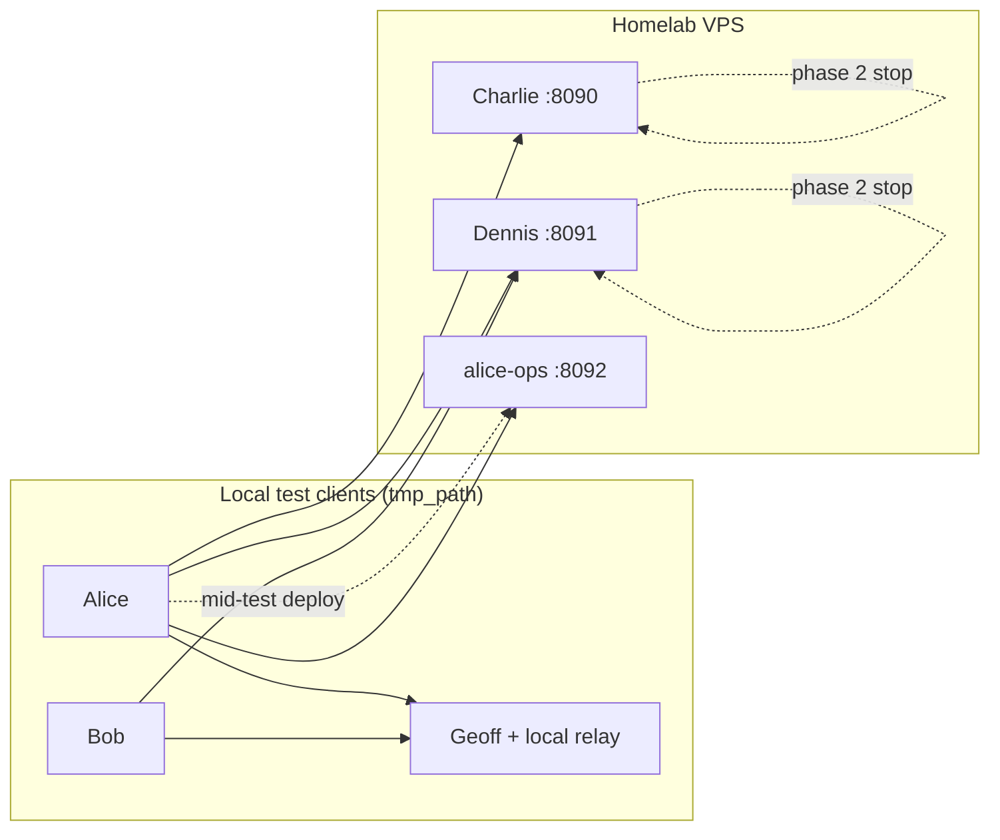

# Five-peer mesh: mid-test Alice homelab relay

**Status:** Passing (simulated + live homelab)  
**Test module:** `packages/yakr-testkit/tests/test_alice_homelab_relay_mesh.py`  
**Harness:** `packages/yakr-testkit/src/yakr_testkit/five_peer_mesh.py`, `five_peer_stress.py`  
**Date of live run:** 2026-07-10

## What this test proves

This integration test exercises a realistic operator story:

1. Alice messages with Bob, Charlie, Dennis, and Geoff over a **hybrid relay mesh** (Bob paired with Dennis; Charlie/Dennis are friend-operated relays).
2. **Mid-conversation**, Alice runs the same workflow a real user would: `yakr relay create alice-ops` → deploy to homelab → republish profile.
3. Charlie and Dennis relays are then **stopped** (outage simulation).
4. Messaging must continue via **alice-ops** (Alice's own relay) and Geoff's local relay — without re-pairing or manual relay configuration on peers.

It validates:

- Dedicated relay operator bundles (`yakr relay create` / deploy)
- Profile republication after a new authorized relay appears
- Per-contact fetch against peer profile relays (not blind polling of every known relay)
- Single-hop delivery with relay failover when primary friend relays are down
- Remote relay stop/start over SSH for homelab outage drills
- End-to-end TLS (pairing-anchored SPKI pins) on real VPS containers

## Topology

```text
Phase 1 (Charlie + Dennis up)
─────────────────────────────
  Alice ──► Charlie relay (homelab :8090) ──► Bob
  Alice ──► Dennis relay  (homelab :8091) ──► Bob
  Alice ◄──────────────────────────────────► Geoff (local in-process relay)

Mid-test: Alice deploys alice-ops
─────────────────────────────────
  yakr relay create alice-ops
  yakr relay deploy alice-ops --vps user@homelab   →  homelab :8092

Phase 2 (Charlie + Dennis stopped)
──────────────────────────────────
  Alice ──► alice-ops relay (homelab :8092) ──► Bob
  Alice ◄────────────────────────────────────► Geoff (local relay)
  Charlie :8090  [STOPPED]
  Dennis  :8091  [STOPPED]
```



## Peers and trust model

| Peer | Role | Simulated | Live homelab |
|------|------|-----------|--------------|
| Alice | Messaging client | `tmp_path/alice` | `tmp_path/alice` |
| Bob | Messaging client | `tmp_path/bob` | `tmp_path/bob` |
| Geoff | Messaging client + local relay | In-process relay | In-process relay |
| Charlie | Friend relay operator | In-process relay | `yakr-charlie` on VPS :8090 |
| Dennis | Friend relay operator | In-process relay | `yakr-dennis` on VPS :8091 |
| alice-ops | Alice's relay operator | In-process (ephemeral port) | `yakr-alice-ops` on VPS :8092 |

Trust rules asserted by `assert_five_peer_trust_model`:

- Alice paired with Bob, Charlie, Dennis, Geoff, and (after activation) alice-ops
- Bob paired with Alice, Dennis, Geoff — **not** with Charlie (learns Charlie only via Alice's profile)
- Geoff paired with Alice and Bob only

Bob's outbound path uses Dennis as his paired relay operator. Alice advertises Charlie, Dennis, and (after phase 1.5) alice-ops in her signed delivery profile.

## Test phases (both variants)

| Step | Action | Messages | Seed |
|------|--------|----------|------|
| 0 | Build five-peer mesh, assert trust model | — | — |
| 1 | `run_five_peer_stress` phase 1 | 36 | 11 |
| 2 | `activate_alice_homelab_relay` | — | — |
| 3 | Assert `alice-ops` contact + profile descriptor | — | — |
| 4 | Stop Charlie + Dennis relays | — | — |
| 5 | `run_five_peer_stress` phase 2 | 36 | 22 |
| 6 | Assert blob store on alice-ops, histories, Geoff delivery | — | — |
| 7 | (live only) Restart Charlie + Dennis in `finally` | — | — |

Stress harness (`run_five_peer_stress`):

- Participants: Alice, Bob, Geoff (random pairwise sends)
- Background **fetch-all** threads per peer (0.05–0.15 s interval simulated; same in live)
- 72 total sends across both phases; success = zero missing inbound, zero pending receipts, matching per-peer histories

## Simulated vs live

| Aspect | `test_alice_homelab_relay_mid_mesh` | `test_alice_homelab_relay_mid_mesh_live` |
|--------|-------------------------------------|------------------------------------------|
| Charlie / Dennis | In-process HTTPS relays | Remote `CHARLIE_URL` / `DENNIS_URL` |
| alice-ops | `_start_relay_server` on `127.0.0.1` | `deploy_operator_bundle` via SSH + Docker |
| Relay stop | Local process stop | `ssh … docker stop yakr-charlie` |
| Blob count check | Local SQLite `relay.db` | `docker exec yakr-alice-ops` over SSH |
| CI | Runs in default pytest | `@pytest.mark.homelab`, skipped without env |
| Runtime | ~7 s | ~40–45 s (includes image build + deploy) |

## Live run results (2026-07-10)

**Target homelab:** `devos@100.125.109.114` (Tailscale)  
**pytest:** 3/3 passed in 44.80 s

```
test_five_peer_trust_model ........................ PASSED
test_alice_homelab_relay_mid_mesh ................. PASSED   (simulated)
test_alice_homelab_relay_mid_mesh_live ............ PASSED   (homelab)
```

### Homelab containers after test

| Container | Host port | Role | Status after test |
|-----------|-----------|------|-------------------|
| `yakr-charlie` | 8090 | Friend relay | Running (restarted in `finally`) |
| `yakr-dennis` | 8091 | Friend relay | Running (restarted in `finally`) |
| `yakr-alice-ops` | 8092 | Alice operator | Running (deployed mid-test) |

### Assertions observed (live)

| Check | Result |
|-------|--------|
| Phase 1 stress (36 msgs) | Pass — no missing inbound, no pending receipts |
| `alice-ops` contact in Alice store | Present |
| `alice-ops` in Alice profile `relay_descriptors` | Present |
| Phase 2 stress with Charlie/Dennis down | Pass |
| Blobs on homelab `alice-ops` | `relay_blob_count > 0` |
| Alice ↔ Bob history consistency (72 msgs) | Pass |
| Charlie/Dennis restart after test | Pass (TLS pins match operator homes) |

### Environment used for live run

```bash
export CHARLIE_URL=https://100.125.109.114:8090
export DENNIS_URL=https://100.125.109.114:8091
export CHARLIE_OPERATOR_HOME=/path/to/charlie-operator   # identity + relay-tls PEMs
export DENNIS_OPERATOR_HOME=/path/to/dennis-operator
export CHARLIE_WRAP_SECRET=ad3_Qrz0t6T-ftW-sUFk4d8jFnZNnpFkBMm2UXE3DmY
export DENNIS_WRAP_SECRET=FJXWbQSyAvPsI7wuGyG8_McBv9Qf-OKAFobDaobaTxQ
export VPS_HOST=devos@100.125.109.114
export CHARLIE_VPS_HOST=devos@100.125.109.114
export DENNIS_VPS_HOST=devos@100.125.109.114
export ALICE_OPS_PORT=8092
```

Operator homes must contain `identity.json` and `relay-tls/` PEMs matching the certs deployed on the VPS (generate with `scripts/generate_operator_relay_tls.py`).

## Issues found and fixed during live bring-up

### 1. TLS directory collision on multi-relay VPS

**Symptom:** After deploying `alice-ops`, Charlie's TLS pin no longer matched; port 8090 served the wrong certificate after `docker start yakr-charlie`.

**Cause:** `deploy_charlie_vps.sh` defaulted to `REMOTE_DIR=~/yakr-relay/tls` for every operator. Deploying alice-ops overwrote Charlie's TLS material in the shared directory.

**Fix:** `relay_deploy.deploy_operator_bundle` sets `REMOTE_DIR=~/yakr-relay-<operator_name>` per operator.

### 2. Stale homelab Docker image (no TLS flags)

**Symptom:** `yakr-relay: error: unrecognized arguments: --ssl-keyfile …`

**Cause:** Homelab image was two days old, predating `--ssl-keyfile` / `--ssl-certfile` support.

**Fix:** Rebuilt and pushed current `yakr-relay:local` before the live run.

### 3. Deploy health-check race

**Symptom:** Deploy script exited 35 while the container was healthy seconds later.

**Fix:** `deploy_charlie_vps.sh` retries `/healthz` for up to 15 s; test harness tolerates `CalledProcessError` and waits with `_wait_relay_healthy`.

## How to reproduce

### Simulated (no homelab)

```bash
uv run pytest packages/yakr-testkit/tests/test_alice_homelab_relay_mesh.py::test_alice_homelab_relay_mid_mesh -v
```

### Live homelab

1. Deploy Charlie and Dennis with pairing-anchored TLS (see [homelab-relay.md](../homelab-relay.md)).
2. Export URLs, operator homes, wrap secrets, and VPS SSH target (see environment block above).
3. Run:

```bash
uv run pytest packages/yakr-testkit/tests/test_alice_homelab_relay_mesh.py::test_alice_homelab_relay_mid_mesh_live -m homelab -v
```

Requires `CHARLIE_VPS_HOST` / `DENNIS_VPS_HOST` (or `VPS_HOST`) for phase-2 `docker stop` / `docker start`.

## Related code

| File | Purpose |
|------|---------|
| `five_peer_mesh.py` | Mesh build (`live=True/False`), `activate_alice_homelab_relay`, `relay_blob_count` |
| `five_peer_stress.py` | Random burst stress across Alice/Bob/Geoff |
| `relay_deploy.py` | Shared VPS deploy for CLI and testkit |
| `relay_create_cmds.py` | `yakr relay create/deploy/status` |
| `scripts/deploy_charlie_vps.sh` | Docker deploy + health retry loop |

## See also

- [mesh-testing-and-resilience.md](./mesh-testing-and-resilience.md) — broader mesh stress catalog
- [homelab-relay.md](../homelab-relay.md) — operator deploy runbook
- [relay-authorization.md](./relay-authorization.md) — who may advertise which relays
